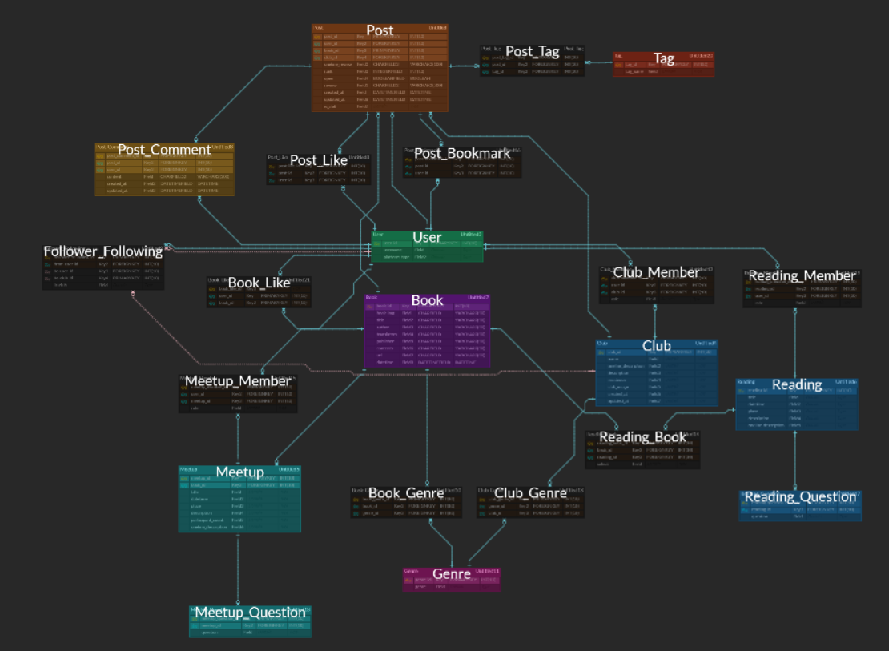
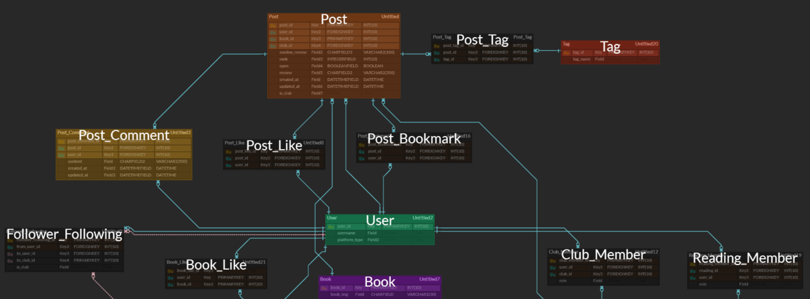
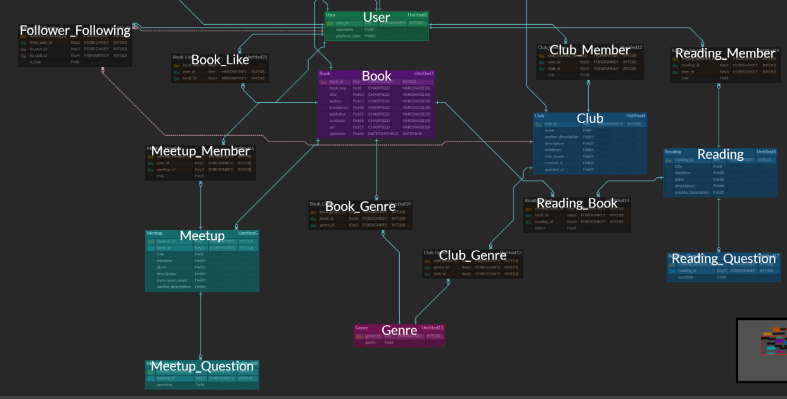

# 20200721 회의록

## 오전

### 1) ERD

- 제일 고민이었던 부분이 Club Member 
  - Club Member를 어떻게 바꿀까? 
- Book
  - 세부 column으로는 translator가 없어도 된다.
- User Genre 모델이 필요하지 않을까?
- Post 쪽은 Tag 모델이 필요하다.
- Post에 대한 좋아요, Bookmark 처리
  - Post 테이블 안에 좋아요 처리를 넣는다.
  - Like와 Bookmark가 겹치지 않을까라는 느낌이 든다.
  - 그렇지만 둘의 직관적 이해가 가능하기 때문에 그냥 두어도 되지 않을까?
- Club의 채널화 진행시
  - Club 좋아요나 Club의 게시물에 대한 처리
  - Club에 대한 Follow가 필요하다.
- Notification
  - 팔로우 요청/ 팔로우 승인을 띄워줘야한다.
  - Firebase도 이용

 

### 2) OAuth

- Kakao와 Google만 이용

- Social Login 알아보기

  > <a href="https://engkimbs.tistory.com/849"> OAuth 설정 </a>

 

### 3) 재미 요소

- 책 추천
  - OOO님이 좋아할만한 책을 추천해봤어요
- Co-book에서 제 3자가 되서 가이드가 되기!
  - 시각적인 효과로 맨 처음 회원가입을 하게 되면 서비스를 어떻게 하는지 튜토리얼처럼 해주자 
- 개인이 목표 설정하고 달성률을 보여줄 수 있는 것

 

## 오후

### 4) 전달사항

- 화면보호기와 바탕화면 바꾸기
- IntelliJ는 팀 당 1개씩 준다.
  - 효진/다훈 중 1명이 쓰는걸로 결정

 

### 5) OAuth

> 효진, 다훈이 공유

- OAuth 연습
  - 금방 될 것 같다.
- 개발 시작 전까지 JPA 연습하기 

 

### 6) Book API

> 채린, 선환, 수민이 공유

<a href="https://data.seoul.go.kr/dataList/OA-15483/A/1/datasetView.do">서울도서관 API </a>

<a href="https://developers.kakao.com/docs/latest/ko/daum-search/dev-guide"> 카카오 API</a>

- 제목, 도서소개, ISBN이 들어있지만 장르가 분류되어 있지 않다. (네이버 역시 장르가 분류되어 있지 않다.)
- 장르 분류
  - 사회과학, 예술 등..
- 서울도서관 인기대출 도서 API를 이용하되, 이미지는 카카오 등 다른 곳에서 가져온다. 

 

### 7) ERD 상세 Discussion

#### 7-1) Book

- book_id는 ISBN이 될 예정
- book_img
- title
- author: 문자열로 
- translators: 문자열로
- publisher
- contents
- datetime (출판일)
- url (detail 페이지)

 

#### 7-2) Genre

- 010, 020 이런식의 분류 기호를 id로 사용한다.

 

#### 7-3) Post

- rank discuss해보기
  - 10점 base
  - 5점 base

 

#### 7-4) 1차 ERD

 

 

 

### 8) 내일 할 일

- Wireframe을 토대로 API discuss하기 
- Convention 정하기 
  - 문서 정리 필요
- 개발 시작

