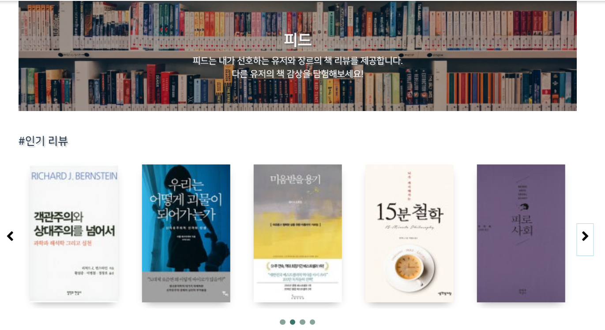
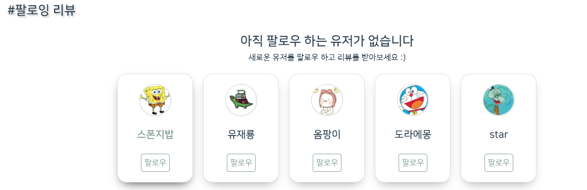

# Welcome to Co-book


> 코북 (Co-book) 웹사이트 

## 🏠 [Homepage]()

<br>

## 👨‍👩‍👦팀원소개


**Soo Min Hwang**

- 🐲Github: [@smhwang0109](https://github.com/smhwang0109)

**Chae Lin Shin**

- 🍒Github: [@scl2589](https://github.com/scl2589)

**Sun Hwan Park**

- 🧙‍♂️Github: [@SunHwan-Park](https://github.com/SunHwan-Park)

**Hyo Jin Lim**

- 🐰Github: [@genie97](https://github.com/genie97)

**Da Hun Jeong**

- 🐼Github: [@PandaHun](https://github.com/PandaHun)

<br>

## 📆 프로젝트 개요

- **진행 기간**: 2020.07.13 ~ 2020.08.21
- **목표**
  - 독서활동을 손쉽게 기록하고, 
  - 다른 사람들과 공유하고 싶은 사람, 
  - 꾸준히 책읽고 싶은 사람, 
  - 책과 사람 모두 만나고 싶은 사람, 
  - 책모임을 더 쉽게 관리하고 활동 내용을 정리하고 싶은 사람
  - :star: 이 모든 사람들을 위한 웹사이트 만들기
- **웹사이트 이름**: Cobook (코북)
  - 책 읽는 사람들을 위한 SNS 커뮤니티 & 모임 매칭 서비스
- **슬로건**: '책 읽는 사람들의 소셜 살롱, 코북'
- **캐릭터**: 책 읽는 거북이, 코북이
  - 귀여운 캐릭터 활용해 서비스 사용의 친근감 제고

<br>

## 📒 Tech Log

<details>
    <summary>1주차</summary>
    <ul>
        <a href="Document/Dev_log/20200710_회의록.md"><li>7/10 - 기획 (모씨 및 어라운드/ 페르소나 설정)</li></a>
    <a href="Document/Dev_log/20200713_회의록.md"><li>7/13 - 기획 (아이돌 - 스토리라인/ 아이돌 왕국)</li></a>
    <a href="Document/Dev_log/20200714_회의록.md"><li>7/14 - 기획 (아이돌- 아이디어 스크럼/ 저작권 관련 & 책모임)</li></a>
    <a href="Document/Dev_log/20200715_회의록.md"><li>7/15 - 개인과제 진행</li></a>
    <a href="Document/Dev_log/20200716_회의록.md"><li>7/16 - 기획(책모임-아이디어 회의/ 프로젝트 방향성/ 와이어프레임)</li></a>
    <a href="Document/Dev_log/20200717_회의록.md"><li>7/17 - 기획 (서비스 이름), Convention 정하기</li></a>
    </ul>
</details>
<details>
    <summary>2주차</summary>
    <ul>
        <li><a href="Document/Dev_log/20200720_회의록.md">7/20 - 기획 (발표 준비) + ERD + 개발 환경 세팅</a></li>
        <li><a href="Document/Dev_log/20200721_회의록.md">7/21 - ERD + OAuth/Book API 관련 discussion</a></li>
        <li><a href="Document/Dev_log/20200722_dev_log.md">7/22 - 기획 발표 + 컨벤션 정리 (Java/Vue) + 지라 이슈 정리 + AWS 확인 + API 요청 리스트 정리</a></li>
        <li><a href="Document/Dev_log/20200723_dev_log.md">7/23 - Back-end (OAuth + Post CRUD) & Front-end (디자인 회의 + Wireframe) </a></li>
        <li><a href="Document/Dev_log/20200724_dev_log.md">7/24 - Back-end (OAuth + Post/Club CR + JPA) + Front-end (Signup/Login page + Club + Feed + Navbar) </a></li>
        <li><a href="Document/Dev_log/20200725_0726_dev_log.md">7/25 ~ 7/26 - Back-end (OAuth) + Front-end (Feed - Create/Detail + Profile - List/Update + Club - Detail/List + Authentication - Password Change)</a></li>
</ul>
</details>
<details>
<summary>3주차</summary>
<ul>
    <li><a href="Document/Dev_log/20200727_dev_log.md">7/27 - Back-end (JWT bug + fix bug + OAuth) + Front-end (Club - Create + Authentication - Background image + Profile - Update + Add Vuetify/Cookies)</a></li>
    <li><a href="Document/Dev_log/20200728_dev_log.md">7/28 - Back-end (프로필 - 상세 조회 + 팔로잉 ) + Front-end (Profile - 팔로잉/팔로워 + Authentication 디자인 수정 + Post/Club API 연결</a></li>
    <li><a href="Document/Dev_log/20200729_dev_log.md">7/29 - Back-end (프로필 - 팔로잉 + Club - 팔로잉) + Front-end (프로필 - 팔로잉/팔로워 모달 구현 + 수정 기능)</a></li>
    <li><a href="Document/Dev_log/20200730_dev_log.md">7/30 - Back-end (Club - Reading Feed) + Front-end (Feed - 무한 스크롤 + 프로필 - 수정 + 팔로잉 기능 실시간 반영)</a></li>
    <li><a href="Document/Dev_log/20200731_dev_log.md">7/31 - Front-end (오류 수정) + 중간 PPT 및 발표 준비 + 중간 시연 영상 제작</a></li>
</ul>
</details>
<details>
    <summary>4주차</summary>
    <ul>
        <li><a href="Document/Dev_log/20200803_dev_log.md">8/3 - Back-end (쿼리 개선 + Meetup - CRUD + Club - CRUD + Authentication - OAuth/Signup) + Front-end(Authentication - Signup fix bug + Password Find + OAuth + Alarm) + 코북이 캐릭터 제작 </a></li>
        <li><a href="Document/Dev_log/20200804_dev_log.md">8/4 - Back-end (쿼리 개선 + Domain 이름 수정 + OAuth - 카카오) + Front-end (Authentication - 비밀번호 찾기 구현/OAuth + Club - 마무리 + Club 생성 및 수정시 이미지 보여주기 + Navbar - redesign) + Firebase 설정</a></li>
        <li><a href="Document/Dev_log/20200805_dev_log.md">8/5 - Back-end (쿼리 개선 + 도메인 수정 + Authentication - Google OAuth) + Front-end (Feed - New Design + Profile - transition + Club - CRUD + Firebase) </a></li>
        <li><a href="Document/Dev_log/20200806_dev_log.md">8/6 - Back-end (서버 및 쿼리 안정화 + Google OAuth 프론트와 연결) & Front-end (Post Detail - New Design + Club - CRUD 완료 + OneDay Event - CRUD) + Firebase</a></li>
        <li><a href="Document/Dev_log/20200807_dev_log.md">8/7 - Back-end (HTTPS 세팅 + 알림) + Front-end (Authentication - 에러메시지 노출 + Book - new design + Club - fix bug + Oneday Event - fix bug) + Web RTC</a></li>
</ul></details>
<details>
    <summary>5주차</summary>
    <ul>
        <li><a href="Document/Dev_log/20200810_dev_log.md">8/10 - Back-end (통계 API + 알림 + https 설정) + Front-end(Profile - 통계 + Book - axios 연결) + Web RTC</a></li>
        <li><a href="Document/Dev_log/20200812_dev_log.md">8/12 - Back-end (Jenkins) + Front-end (Book - Genre 추가 + Search - 기본 디자인 + Feed - New Design) + Web RTC + 아이콘 </a></li>
        <li><a href="Document/Dev_log/20200813_dev_log.md">8/13 - Back-end (Search - 도서 API) & Front-end (Feed - banner 추가 + Search - User/ Review/ Book/ Club + 카드 shadow 추가 + Jenkins +  OneDayEvent/ClubEvent - 시간 제한) + Web RTC</a></li>
        <li><a href="Document/Dev_log/20200814_dev_log.md">8/14 - Back-end (알림 API + Jenkins - Back쪽 성공) + Front-end (Search - router 문제 해결/ link 추가 + Navigation - margin 추가 + Carousel 추가 + 최초 로그인 후 장르 선택 Modal + SweetAlert 추가) + Web RTC</a></li>
        <li><a href="Document/Dev_log/20200815_dev_log.md">8/15 - Front-end (Search - tag 검색 추가 + 뒤로가기 버튼 - Sweetalert) + 영상 회의 (시연 영상 & UCC 영상 [동원참치 패러디]) </a></li>
        <li><a href="Document/Dev_log/20200816_dev_log.md">8/16 - Back-end (Genre API) + Front-end (Navbar - dropdown-menu 위치 수정 + ProfileFeed/ ProfileBookmark - 생성 역순으로 정렬 + ProfileOverview - 통계 색감 변경 + Footer + 위로가기 버튼 추가 + 버튼 색감 변경 ) + Web RTC</a></li>
</ul></details>
<details>
    <summary>6주차</summary>
    <ul>
        <li><a href="Document/Dev_log/20200817_dev_log.md">8/17 -Front-end(ReviewDetail/ BookDetail - 닉네임 한 줄 수정 + BookClub/ OnedayEvent/ ProfileBookmark/ ProfileFeed - 6개씩 미리 게시물 보여주기 + Notification - 북클럽 가입 승인/ 알림 디자인 + Search - 검색 결과 수정 + 팔로잉/팔로우 수정 + Profile - default image 수정 + ProfileFeed - 팔로잉 없을 시 유저 추천 카드 생성 +  Inifinite Loading 추가) + 동원참치 패러디 영상 촬영 </a></li>
        <li><a href="Document/Dev_log/20200818_dev_log.md">8/18 - Back-end (Jenkins 진행 + Genre API + OAuth2 Validation + Social Login) + Front-end (Footer - 하단 고정 + 화상통화 + Login - 에러메시지 수정 + ) + 시연영상 대본 + UCC 셀레브 형식 영상 촬영</a></li>
        <li><a href="Document/Dev_log/20200819_dev_log.md">8/19 - Back-end (화상통화 API + 이벤트 찾기 API) + Front-end (화상통화 - Webex 도입 완료 + Footer - 위치 수정 + Infinite Scroll 멘트 수정 + 이메일 재전송 + Signup/Login/PasswordChange - design 수정 + OnedayEventDetail/ ClubDetail - leader 표시 + Banner - width 수정 + Console error 수정) + 발표 PPT 제작 + 영상 편집 (동원 참치 패러디)</a></li>
        <li><a href="Document/Dev_log/20200820_dev_log.md">8/20 - Back-end (서버 및 쿼리 안정화 + Google OAuth 프론트와 연결) & Front-end (Notification - 수정 + Signup - 회원가입 완료 페이지 routing + Login/ Signup/PasswordChange - background image 수정) + 발표 준비 및 피드백 + 영상 편집 (동원 참치 패러디 완료 + 시연 영상 완료)</a></li>
        <li><a href="Document/Dev_log/20200821_dev_log.md">8/21 - 최종발표</a></li>
</ul></details>
<details>
    <summary>Convention</summary>
    <ul>
        <a href="Document/Convention/#만든이101_Convention.md"><li>#만든이101 Convention</li></a>
        <a href="Document/Convention/Java_Convention.md"><li>Java Convention</li></a>
    <a href="Document/Convention/Vue_Vuex_Convention.md"><li>Vue Convention</li></a>
    </ul>
</details>
<details>
    <summary>Proposal</summary>
    <ul>
        <a href="Document/Proposal/cobook_기획안.md"><li>기획안 Markdown</li></a>
        <a href="Document/Proposal/기획안_ver.pdf"><li>기획안 PDF</li></a>
    </ul>
</details>
<details>
    <summary>Wireframe</summary>
    <ul>
        <a href="Document/Wireframe"><li>Wireframe 확인하기</li></a>
    </ul>
</details>
<details>
    <summary>Video Plan & Proposal</summary>
    <ul>
        <a href="Document/video/영상편집_Plan.md"><li>영상편집 계획</li></a>
        <a href="Document/Video/코북_영상_기획.md"><li>코북 영상 기획</li></a>
    </ul>
</details>

<br>

## 🔧 Tech Stack


<details>
    <summary>Front 자세히 살펴보기</summary>
    <ul>
        <li>Vue: 2.6.11</li>
        <li>Vue CLI: 4.3.1</li>
        <li>Vuex: 3.4.0</li>
        <li>Vuetify: 2.2.11</li>
        <li>SweetAlert2: 9.17.1</li>
        <li>chart.js: 3.6.5</li>
        <li>firebase: 7.17.1</li>
        <li>axios: 0.19.2</li>
    </ul>
</details>

<details>
    <summary>Back 자세히 살펴보기</summary>
    <ul>
        <li>Swagger: 2.9.2</li>
        <li>Spring Boot</li>
        <li>Spring Security</li>
        <li>Spring Jenkins</li>
        <li>NGINX</li>
        <li>E2C</li>
    </ul>
</details>

<br>

## ⚙️ Install and Usage

### Frontend

- frontend 폴더로 들어와 필요한 패키지를 설치합니다.

  - ```bash
    $ npm i
    ```

- frontend 폴더 (vue 프로젝트)를 실행합니다.

  - ```bash
    $ npm run serve
    ```

### Backend

- Java (Open JDK 14)를 설치합니다.
- Maven을 설치합니다.
- VS Code 및 관련 Spring Boot Extension Pack 설치합니다.
- Docker를 설치합니다.

> Maria DB 컨테이너 실행

- `docker run --name-db -p 3306:3306 -e MYSQL_ROOT_PASSWORD={패스워드} -d mariddb`
  - 패스워드를 칠 때는, 대괄호를 지우고 칩니다.

- `docker exec -it maria-db mysql -u root -p`
  - docker를 켜고, maria-db를 실행하기 위한 코드입니다.

> DB 테이블 생성

- DB 테이블을 생성합니다.

<br>

## ✨개발목표

> 3가지 가치를 통해 책 읽는 사람, 읽고 싶은 사람들을 위한 웹사이트 구현


#### 편리성을 위한 '피드'

- 리뷰들을 한눈에 모아보고,  다른 사람들과 소통할 수 있습니다.

#### 연결을 위한 '북클럽'

- 책을 읽은 후 느낀 감동 혹은 재미를 공유하고 싶나요? 

- 온라인 책모임을 매칭하여 사용자들이 같은 책을 읽고 함께 이야기를 나눌 수 있습니다.

#### 정리를 위한 '서재'

- 본인의 독서 리뷰, 북클럽, 통계 등을 쉽게 관리할 수 있는 나만의 서재를 제공합니다.

<br>

## ⭐️ 주요 기능

### Feed

> 유저들의 책 리뷰 게시물을 모아 놓은 공간

- Feed
  - 팔로우한 유저가 작성한 책 리뷰 게시물 확인
  - 책 리뷰의 긴 '텍스트 형태'보다는 이를 요약하는 이미지 위주의 게시물 노출
    - 이미지 Hover시 평점, 한줄평, 닉네임 확인 가능 (**사용자 interaction 증가**)
- 상세 리뷰
  - 책의 형태로 제공되며, 책에 대한 기본 정보와 유저가 작성한 리뷰 확인
  - 한줄 평 뿐만 아니라 동일한 책에 대한 다른 유저의 리뷰 노출
  - 댓글 작성 가능
  - 태그, 좋아요, 북마크, 공유하기 기능


### Book

- 책에 대한 줄거리 및 상세 정보 확인 
- 코북 유저들의 리뷰 한 눈에 확인


### BookClub

>  책 모임 매칭 서비스, 클럽

- BookClub
  
  > 정기적으로 책모임을 갖는 하나의 그룹
  
  - 내가 선호하는 장르를 기반으로 현재 모집 중인 클럽 찾기 가능
  
  - 클럽 멤버, 클럽 설명, 주요 장르, 위치 (온라인/오프라인) 확인 가능
  
- BookClub Event

  > 클럽 안에서 진행되는 정기적인, 한 번의 책 모임

  - 리딩에 참여할 멤버, 멤버 개개인이 해당 책에 대해 작성한 리뷰, 리딩에서 진행될 질문지 확인 가능
  - <u>온라인</u>으로 진행할 경우, **Webex를 통한 온라인 독서모임 지원**


### Oneday Event

>  클럽과 관계없이 진행되는 일회성 책모임

- 내가 선호하는 장르를 기반으로 현재 모집중인 원데이 이벤트 찾기 가능

- 원데이 이벤트에 참여할 멤버, 개개인이 해당 책에 대해 작성한 리뷰, 원데이 이벤트에서 진행될 질문지 확인 가능
- <u>온라인</u>으로 진행할 경우, **Webex를 통한 온라인 독서모임 지원**


### Profile

>  독서 활동 관리 서비스

- 내가 작성한 책 리뷰 확인
- 내가 가입한 북클럽 및 참여중인 북클럽/원데이 이벤트 확인 
- 내가 북마크한 게시물 확인
- 나의 독서 활동을 캘린더와 통계를 통해 확인 
- 팔로우와 팔로워를 통한 유저간의 소통


### Search

> 검색 서비스

- Review 검색 결과: 한줄평 및 태그로 검색 가능
- User 검색 결과: 닉네임으로 검색 가능
- Book 검색 결과: 도서명, 저자, 장르로 검색 가능
- Book Club 검색 결과: 북클럽 이름, 장르로 검색 가능
- Oneday Event 검색 결과: 원데이 이벤트 이름, 장르로 검색 가능

<br>

## 👀 페이지 소개

### Feed

#### 피드

> 인기 리뷰, 팔로잉한 유저들의 리뷰, 관심 장르 리뷰로 구성

##### 인기 리뷰



##### 팔로잉한 유저들의 리뷰, 관심 장르 리뷰


#### 

##### 팔로우 하는 유저가 없을 때



##### 내가 선호하는 장르에 리뷰가 작성되지 않았을 때


##### 피드 Hover시 효과


#### 리뷰 상세 페이지


<br>

### Book

#### 책 상세 페이지


<br>

### BookClub

#### 북클럽 리스트


#### 북클럽 생성 및 수정


#### 북클럽 상세 페이지 


#### 북클럽 이벤트 상세 페이지


<br>

### Oneday Event

#### 원데이이벤트 리스트


#### 원데이이벤트 생성 및 수정


#### 원데이이벤트 상세 페이지


<br>

### Profile

#### 리뷰


#### 북클럽/이벤트


#### 북마크


#### 일정/통계

##### 캘린더


##### 통계


<br>

## 🎞 최종산출물

- <a href="https://www.youtube.com/watch?v=hAW3b7z9Ifo&feature=youtu.be">중간발표 시연영상 </a>
- <a href="https://youtu.be/X8WfPhbEnXE">최종발표 코북광고</a>
- <a href="https://youtu.be/bOfSSnoSVi0">최종발표 시연영상</a>
- <a href="https://youtu.be/MAfjGcCyYQw">최종발표 UCC</a>
- <a href="">최종발표 pdf</a>

